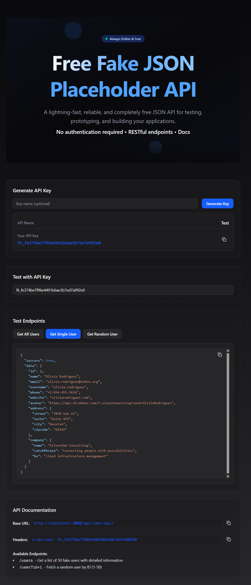

# Fake API Service
### A simple Next.js project that provides a fake API service for testing and development purposes.



Live Demo: [Deploy Vercel Link](https://fake-json-placeholder-api.vercel.app/)

## Features
- Generate API keys for secure access
- Test various API endpoints with custom payloads
- View interactive API documentation
- Light and Dark Mode Support for better accessibility
- Built with Next.js, TypeScript, and Prisma

## Getting Started

### Installation
```bash
npm install
```

### Running the Development Server
```bash
npm run dev
```

Open [http://localhost:3000](http://localhost:3000) in your browser to view the app.

## Project Structure
- `app/` - Next.js app directory and API routes
- `components/` - UI and feature components (API key, documentation, endpoint testing, theme)
- `lib/` - Utility functions and database helpers
- `prisma/` - Prisma schema and client for database access
- `public/` - Static assets and preview images
- `types/` - TypeScript types for API and data models

## License
MIT
